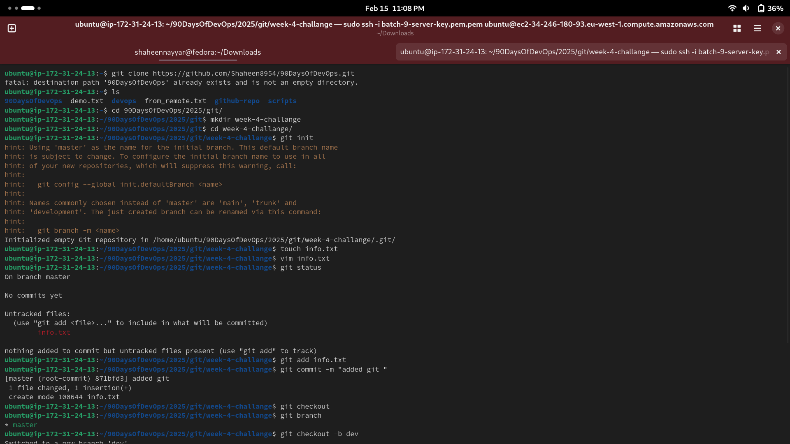

# WEEK 4 CHALLANGE
## fork, clone and initialize the repository and create a file also, configure remote URL with PAT and PUSH/PULL.

1. First of all we need to understand about git.
     So git is a tool to track changes in files and work with others easily. Think of it like google Docs for coding or files.Where you can see edits, undo mistakes and collabrate.

2. understanding key Terms:

  . Fork - Making a file from others repository to your account.

  . Clone - Download a file from your github to local.

  . initialize the repository - Creating a new git project on your local computer by git init.

  . Create a file - create a file  to start.

  . Remote URL - the online location of your project (on github ) 

  . PAT(Personal access token ) - A Password like key used to access github securly.

  . PUSH - Uploading your changes from your local to github.

  . PULL - downloading the latest update from your github to local.

